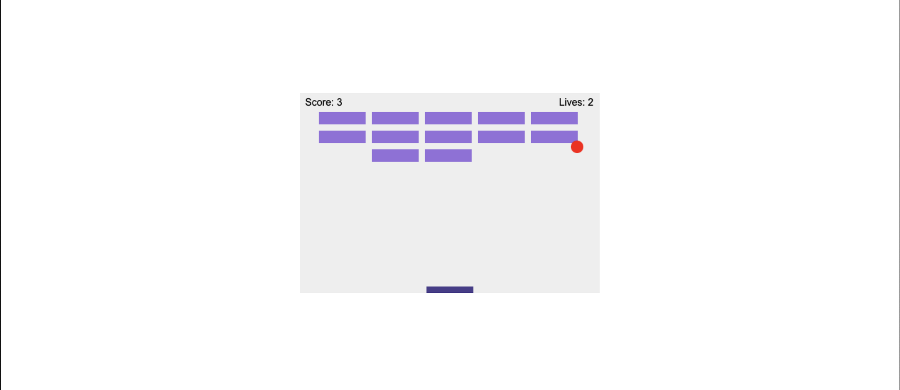

# BreakoutGame

This repository contains a 2D breakout game built using pure `JavaScript`, `HTML` and `CSS`. The game is a classic arcade-style experience where players use a paddle to bounce a ball and break bricks on the screen.

   